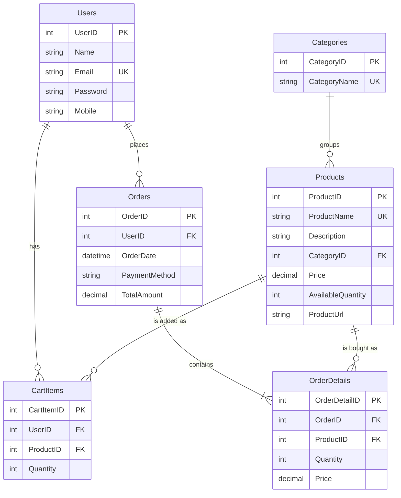

# Entity relationship diagram

Six tables. A line means a foreign key. `||` is exactly one. `o{` is zero or many.

`CartItems` also has a unique pair `(UserID, ProductID)`. One user cannot have two cart rows for the same product. Adding that product again increases `Quantity`.

Open this file in preview to see the diagram. In Cursor or VS Code, right-click the file and choose Open Preview, or press `Ctrl+Shift+V`.

## What each relationship means

| From | To | Cardinality | Foreign key | In words |
| --- | --- | --- | --- | --- |
| Categories | Products | one to many | `Products.CategoryID` → `Categories.CategoryID` | One category has many products. Every product belongs to exactly one category. |
| Users | CartItems | one to many | `CartItems.UserID` → `Users.UserID` | One user has many cart lines, or none. Every cart line belongs to exactly one user. |
| Products | CartItems | one to many | `CartItems.ProductID` → `Products.ProductID` | One product can sit in many carts. Every cart line points at exactly one product. |
| Users | Orders | one to many | `Orders.UserID` → `Users.UserID` | One user places many orders, or none. Every order belongs to exactly one user. |
| Orders | OrderDetails | one to many | `OrderDetails.OrderID` → `Orders.OrderID` | One order has many lines. Checkout always writes at least one line. Every line belongs to exactly one order. |
| Products | OrderDetails | one to many | `OrderDetails.ProductID` → `Products.ProductID` | One product can appear on many past orders. Every order line points at exactly one product. |

There is no direct line from `CartItems` to `Orders`. Checkout reads the cart, copies each line into `OrderDetails`, then deletes the cart rows.

## Keys

- **Primary key (PK):** identifies one row. `UserID`, `CategoryID`, `ProductID`, `CartItemID`, `OrderID`, `OrderDetailID`. The database generates them.
- **Foreign key (FK):** a column that must match a primary key in another table. `Products.CategoryID` cannot point at a category that does not exist.
- **Unique key (UK):** `Email` and `CategoryName` and `ProductName` cannot repeat. Cart uniqueness is the pair `UserID` + `ProductID`, not a single column.

## How a real purchase uses the diagram

1. `Categories` and `Products` already exist from the seed data. Example: category Books, product Python Programming Guide.
2. `Users` gets one row at register.
3. Add to cart inserts one `CartItems` row: that `UserID` + that `ProductID` + `Quantity`.
4. Checkout inserts one `Orders` row for that `UserID`, then one `OrderDetails` row per cart line. `OrderDetails.Price` is a copy of `Products.Price` at that moment.
5. `Products.AvailableQuantity` goes down by the ordered quantity.
6. Those `CartItems` rows are deleted. The order remains.

`Orders.TotalAmount` is not a foreign key. It is the sum of each line's `Price * Quantity`, calculated by the server.
