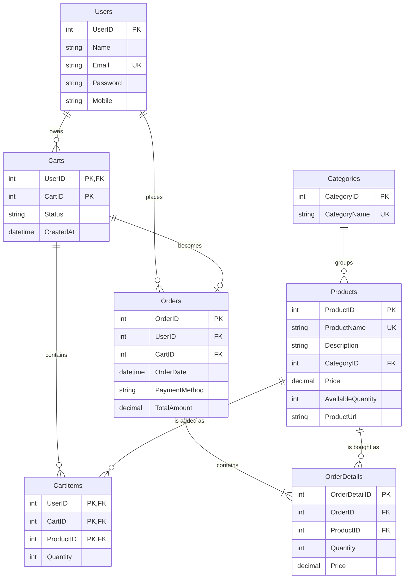

# Entity relationship diagram

Seven tables. A line means a foreign key. `||` is exactly one. `o{` is zero or many. `o|` is zero or one.

`Carts` is the basket. `CartID` starts at 1 for every user. User 2 and user 9 both have a cart 1. A user has only one cart with `Status = OPEN`. That open cart is the bucket of products not ordered yet.

`CartItems` has no `CartItemID`. A line is identified by the cart plus the product. Adding that product again increases `Quantity`.

Open this file in preview to see the diagram. In Cursor or VS Code, right-click the file and choose Open Preview, or press `Ctrl+Shift+V`.

## What each relationship means

| From | To | Cardinality | Foreign key | In words |
| --- | --- | --- | --- | --- |
| Categories | Products | one to many | `Products.CategoryID` → `Categories.CategoryID` | One category has many products. Every product belongs to exactly one category. |
| Users | Carts | one to many | `Carts.UserID` → `Users.UserID` | One user has many baskets over time, or none. Every basket belongs to exactly one user. |
| Carts | CartItems | one to many | `(CartItems.UserID, CartItems.CartID)` → `(Carts.UserID, Carts.CartID)` | One basket has many product lines, or none. Every line belongs to exactly one basket. |
| Products | CartItems | one to many | `CartItems.ProductID` → `Products.ProductID` | One product can sit in many baskets. Every line points at exactly one product. |
| Users | Orders | one to many | `Orders.UserID` → `Users.UserID` | One user places many orders, or none. Every order belongs to exactly one user. |
| Carts | Orders | one to zero or one | `(Orders.UserID, Orders.CartID)` → `(Carts.UserID, Carts.CartID)` | Checkout turns one open basket into one order. A basket that is still open has no order. |
| Orders | OrderDetails | one to many | `OrderDetails.OrderID` → `Orders.OrderID` | One order has many lines. Checkout always writes at least one line. Every line belongs to exactly one order. |
| Products | OrderDetails | one to many | `OrderDetails.ProductID` → `Products.ProductID` | One product can appear on many past orders. Every order line points at exactly one product. |

Checkout reads the open cart, copies each line into `OrderDetails`, reduces stock, and sets that cart's `Status` to `ORDERED`. The lines stay on the cart. They are no longer the shopping basket. The next add creates the next `CartID` for that user.

## Keys

- **Primary key (PK):** identifies one row. `UserID`, `CategoryID`, `ProductID`, `OrderID`, and `OrderDetailID` are generated by the database. A cart is identified by `UserID` + `CartID`. A cart line is identified by `UserID` + `CartID` + `ProductID`.
- **Foreign key (FK):** a column that must match a primary key in another table. `Products.CategoryID` cannot point at a category that does not exist. An order cannot point at another user's cart.
- **Unique key (UK):** `Email`, `CategoryName`, and `ProductName` cannot repeat. One user cannot have two open carts. One cart cannot be checked out twice.

## How a real purchase uses the diagram

1. `Categories` and `Products` already exist from the seed data. Example: category Books, product Python Programming Guide.
2. `Users` gets one row at register.
3. The first add creates `Carts` row `(UserID, CartID=1, Status=OPEN)` and one `CartItems` line for that product.
4. Checkout inserts one `Orders` row with that `UserID` and `CartID`, then one `OrderDetails` row per cart line. `OrderDetails.Price` is a copy of `Products.Price` at that moment.
5. `Products.AvailableQuantity` goes down by the ordered quantity.
6. That cart's `Status` becomes `ORDERED`. The next add for the same user creates cart 2.

`Orders.TotalAmount` is not a foreign key. It is the sum of each line's `Price * Quantity`, calculated by the server.
